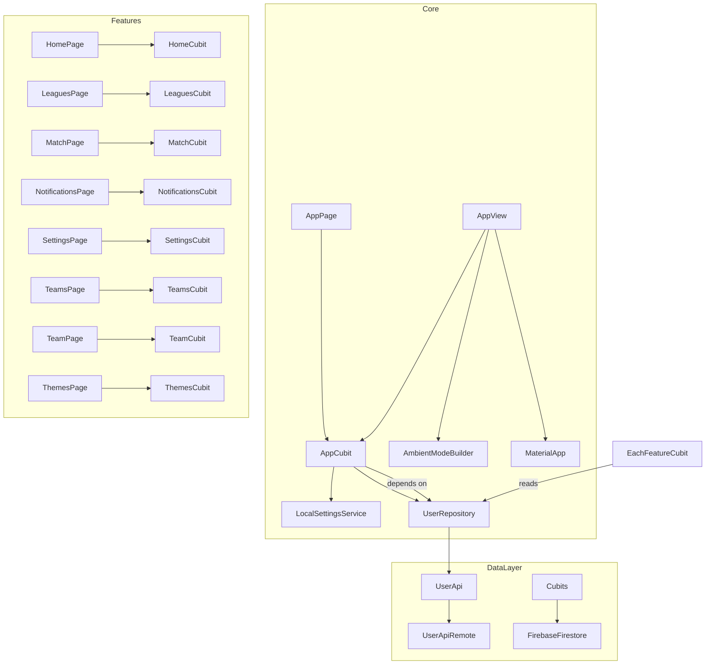

# 📖 Tiki Taka Scoreboard WearOS – Code Documentation

![coverage][coverage_badge]
[![style: very good analysis][very_good_analysis_badge]][very_good_analysis_link]
[![License: MIT][license_badge]][license_link]

Welcome to the comprehensive documentation for the **Tiki Taka Scoreboard WearOS** application. This guide covers all key Dart files, organized by functional modules, explains their responsibilities, and illustrates how they interconnect.

---

## 📑 Table of Contents

1. [Ambient Mode](#ambient-mode)  
2. [App Core](#app-core)  
   2.1 [State Management (AppCubit)](#state-management-appcubit)  
   2.2 [Global Utilities](#global-utilities)  
   2.3 [Routing & Themes](#routing--themes)  
   2.4 [Services](#services)  
   2.5 [UI Layer (View & Widgets)](#ui-layer-view--widgets)  
3. [Feature Modules](#feature-modules)  
   3.1 [Home](#home)  
   3.2 [Leagues](#leagues)  
   3.3 [Match](#match)  
   3.4 [Notifications](#notifications)  
   3.5 [Settings](#settings)  
   3.6 [Team & Teams](#team--teams)  
   3.7 [Themes](#themes)  
4. [Localization (l10n)](#localization-l10n)  
5. [Bootstrap & Entrypoint](#bootstrap--entrypoint)  
6. [Packages & Data Models](#packages--data-models)  
   6.1 [user_api](#user_api)  
   6.2 [user_api_remote](#user_api_remote)  
   6.3 [user_repository](#user_repository)  
7. [Configuration (`pubspec.yaml`)](#configuration-pubspecyaml)

---

## Ambient Mode

| File                                              | Responsibility                                                                               |
|---------------------------------------------------|----------------------------------------------------------------------------------------------|
| **lib/ambient_mode/ambient_mode.dart**            | Barrel export for ambient-mode widgets and listener.                                         |
| **lib/ambient_mode/view/ambient_mode_listener.dart** | A singleton `ValueNotifier<bool>` that listens on a `MethodChannel('ambient_mode')` for Android Wear OS ambient events. |
| **lib/ambient_mode/view/ambient_mode_builder.dart**  | `StatelessWidget` wrapping a `ValueListenableBuilder` over `AmbientModeListener` to rebuild UI based on ambient mode. |

> **Purpose:**  
> - Detect when the watch enters/exits ambient mode (low-power display).  
> - Allow UI theme adjustments (e.g., dimmed colors) seamlessly.

---

## App Core

### 1. State Management (AppCubit)

| File                             | Role                                                                                          |
|----------------------------------|-----------------------------------------------------------------------------------------------|
| **lib/app/cubit/app_cubit.dart** | Manages **global app state**: dark mode & language. Persists preferences via `UserRepository` and syncs to Firestore via `LocalSettingsService`. |
| **lib/app/cubit/app_state.dart** | Immutable state with `darkMode` (bool) and `language` (String). Supports `copyWith`.        |

**Core Methods in `AppCubit`:**
- `initialLoad()`  
  - Reads saved dark-mode & language.  
  - If unset, initializes defaults (`true` for dark, `en_US` for locale).  
  - Emits updated `AppState`.
- `changeTheme(darkMode: bool)`  
  - Persists locally & on Firestore.  
  - Emits new `AppState.darkMode`.
- `changeLanguage(String)`  
  - Persists locally & on Firestore.  
  - Emits new `AppState.language`.

---

### 2. Global Utilities

| File                             | Role                                                                                          |
|----------------------------------|-----------------------------------------------------------------------------------------------|
| **lib/app/global/functions.dart**  | Collection of UI/data helper functions:  
  - Formatting match states & dates (`getMatchState`, `notMatchState`)  
  - Mapping colors, icons, staff positions  
  - `NetworkSvgLoader` for async SVG loading & vector graphics decoding. |
| **lib/app/global/variables.dart**  | App-wide constants:  
  - `navigatorKey`, shimmer counts, scroll parameters  
  - Firestore collection names (`matches`, `configs`, `leagues`, etc.)  
  - Messaging topics & notification types. |
| **lib/app/global/global.dart**     | Barrel exporting `functions.dart` and `variables.dart`.                                      |

---

### 3. Routing & Themes

| File                                  | Role                                                                                  |
|---------------------------------------|---------------------------------------------------------------------------------------|
| **lib/app/misc/app_routes.dart**      | Defines `Map<String, WidgetBuilder>` for `MaterialApp.routes`:  
  - `/` → `HomePage`  
  - `/match`, `/team`, `/settings`, `/leagues`, `/languages`, `/themes`, `/notifications`, `/teams`. |
| **lib/app/misc/app_themes.dart**      | Two functions returning `ThemeData` based on `isAmbientModeActive`:  
  - `appDarkTheme(...)`  
  - `appLightTheme(...)`  
  Theme variations tune colors, card shapes, button styles for ambient mode. |
| **lib/app/misc/misc.dart**            | Barrel exporting routes & themes.                                                       |

---

### 4. Services

| File                                            | Role                                                                                |
|-------------------------------------------------|-------------------------------------------------------------------------------------|
| **lib/app/services/local_settings_service.dart** | Singleton managing `SharedPreferences`, device & package info:  
  - `initialize()` sets up preferences, `DeviceInfoPlugin`, `PackageInfo`.  
  - `getLocalLanguage()`, `getDarkMode()`.  
  - `saveLanguageOnFirestore()`, `saveDarkModeOnFirestore()`. |
| **lib/app/services/notification_service.dart**   | Singleton handling FCM & local notifications:  
  - `initialize()` sets background handler, requests permissions, obtains token, sets up channels.  
  - Routes background & foreground messages to UI (e.g., navigates to match).  
  - Subscribe/unsubscribe to topics.   |
| **lib/app/services/services.dart**               | Barrel exporting the two services.                                                  |

---

### 5. UI Layer (View & Widgets)

#### View

| File                               | Role                                                                                          |
|------------------------------------|-----------------------------------------------------------------------------------------------|
| **lib/app/view/app_page.dart**     | Top-level widget injecting `UserRepository` & `AppCubit` into widget tree via `MultiProvider`. |
| **lib/app/view/app_view.dart**     | 
  - Calls `AppCubit.initialLoad()`.  
  - Wraps `HomePage` in `AmbientModeBuilder` → `MaterialApp`.  
  - Configures theme, locale, routes, l10n delegates. |
| **lib/app/view/view.dart**         | Barrel exporting `app_page.dart` & `app_view.dart`.                                          |

#### Widgets

| File                          | Role                                                                                                             |
|-------------------------------|------------------------------------------------------------------------------------------------------------------|
| **app_card_data.dart**        | Styled `Card` with horizontal padding & inner padding.                                                          |
| **app_shimmer.dart**          | Shimmer placeholder for loading states.                                                                          |
| **crest_image.dart**          | Loads & displays club crest via `VectorGraphics`.                                                                |
| **ripple_background.dart**    | Animated ripple effect behind content.                                                                           |
| **ripple_painter.dart**       | `CustomPainter` used by ripple background to draw expanding circles.                                              |
| **scroll_text.dart**          | Marquee/scrolling text using `text_scroll` package.                                                              |
| **widgets.dart**              | Barrel exporting all above.                                                                                     |

---

## Feature Modules

Each feature follows a structure:
1. **barrel** file (`feature.dart`) exporting `cubit/` and `view/`.
2. **Cubic**: `feature_cubit.dart` + `feature_state.dart`.
3. **Page**: Stateless widget providing the cubit.
4. **View**: Stateful widget consuming cubit & Firestore streams, rendering UI.

---

### Home

- **lib/home/home.dart**  
- **lib/home/cubit/home_cubit.dart**  
- **lib/home/cubit/home_state.dart**  
- **lib/home/view/home_page.dart**  
- **lib/home/view/home_view.dart**  

**Flow:**  
`HomePage` → `HomeCubit.initCollections()` → fetch `matches` & `configs` collections → `HomeView` uses `StreamBuilder` to display today’s matches, shimmers, error state, etc.

---

### Leagues

- **lib/leagues/leagues.dart**  
- **lib/leagues/cubit/leagues_cubit.dart**  
- **lib/leagues/cubit/leagues_state.dart**  
- **lib/leagues/view/leagues_page.dart**  
- **lib/leagues/view/leagues_view.dart**  

**Highlights:**  
- Toggles league enable/disable via `toggleLeague()`.  
- Persists to `UserRepository`.  
- UI presents a rotary-scroll list of leagues with switches.

---

### Match

- **lib/match/match.dart**  
- **lib/match/cubit/match_cubit.dart**  
- **lib/match/cubit/match_state.dart**  
- **lib/match/view/match_page.dart**  
- **lib/match/view/match_view.dart**  

**Capabilities:**  
- Displays match details, score updates, and league standings.  
- Highlights home/away rows in standings.  
- Back button to return to previous screen.

---

### Notifications

- **lib/notifications/notifications.dart**  
- **lib/notifications/cubit/notifications_cubit.dart**  
- **lib/notifications/cubit/notifications_state.dart**  
- **lib/notifications/view/notifications_page.dart**  
- **lib/notifications/view/notifications_view.dart**  

**Features:**  
- Lists subscribed leagues (Firestore).  
- Handles empty, loading, and error states with shimmers & messages.

---

### Settings

- **lib/settings/settings.dart**  
- **lib/settings/cubit/settings_cubit.dart**  
- **lib/settings/cubit/settings_state.dart**  
- **lib/settings/view/settings_page.dart**  
- **lib/settings/view/settings_view.dart**  

**Controls:**  
- Language selector  
- Theme toggle  
- Links to Leagues, Notifications, Themes sub-pages  
- Displays app info (version, build, last update)

---

### Team & Teams

#### Teams

- **lib/teams/teams.dart**  
- **lib/teams/cubit/teams_cubit.dart**  
- **lib/teams/cubit/teams_state.dart**  
- **lib/teams/view/teams_page.dart**  
- **lib/teams/view/teams_view.dart**  

#### Team

- **lib/team/team.dart**  
- **lib/team/cubit/team_cubit.dart**  
- **lib/team/cubit/team_state.dart**  
- **lib/team/view/team_page.dart**  
- **lib/team/view/team_view.dart**  

**Detail:**  
- `Teams` lists clubs in a league; `Team` shows individual club details.  
- Firestore queries filtered by leagueId/teamId.

---

### Themes

- **lib/themes/themes.dart**  
- **lib/themes/cubit/themes_cubit.dart**  
- **lib/themes/cubit/themes_state.dart**  
- **lib/themes/view/themes_page.dart**  
- **lib/themes/view/themes_view.dart**  

**Purpose:**  
- Adjust UI accents, perhaps switch material theme variants.  
- Minimal state: initial/loading/success/failure flow.

---

## Localization (l10n)

| File                               | Role                                                  |
|------------------------------------|-------------------------------------------------------|
| **lib/l10n/arb/app_en.arb**        | English strings.                                      |
| **lib/l10n/arb/app_es.arb**        | Spanish strings.                                      |
| **lib/l10n/arb/app_it.arb**        | Italian strings.                                      |
| **lib/l10n/l10n.dart**             | Generated localization delegates & lookup.            |
| **lib/l10n/l10n_en.dart**          | English implementation.                               |
| **lib/l10n/l10n_es.dart**          | Spanish implementation.                               |
| **lib/l10n/l10n_it.dart**          | Italian implementation.                               |

**Mechanism:** Flutter’s ARB → `flutter_localizations` → `AppLocalizations` used by `MaterialApp`.

---

## Bootstrap & Entrypoint

| File                          | Role                                                                                   |
|-------------------------------|----------------------------------------------------------------------------------------|
| **lib/bootstrap.dart**        | Sets a custom `BlocObserver` for logging, catches Flutter errors, and runs `runApp`.   |
| **lib/firebase_options.dart** | Auto-generated via FlutterFire CLI: supplies `FirebaseOptions` per platform.            |
| **lib/main.dart**             |  
  1. Initializes Flutter & Firebase  
  2. Sets up `SharedPreferences`, `UserApiRemote`, `UserRepository`  
  3. Initializes `LocalSettingsService` & `NotificationService`  
  4. Calls `bootstrap(() => AppPage(...))`. |

---

## Packages & Data Models

### user_api

- **packages/user_api/lib/src/models/** → Generated JSON-serializable classes: `Area`, `Competition`, `Config`, `Contract`, `League`, `Match`, `Odds`, `Referee`, `Score`, `Season`, `Staff`, `Standing`, `Table`, `Team`, `Time`.  
- **packages/user_api/lib/src/user_api.dart** → Abstract API interface.  
- **packages/user_api/lib/user_api.dart** → Exports models & interface.

### user_api_remote

- **packages/user_api_remote/lib/src/user_api_remote.dart** → Implements `UserApi` against a remote HTTP/REST endpoint.  

### user_repository

- **packages/user_repository/lib/src/user_repository.dart** →  
  - Bridges `UserApi` & `LocalSettingsService`.  
  - Persists preferences locally.  
  - Exposes methods like `getEnabledLeagues()`, `saveEnabledLeague()`, `getDarkMode()`, `saveDarkMode()`, etc.

These packages form the **data/logic layer** feeding the Flutter UI.

---

## Configuration (pubspec.yaml)

- Declares dependencies: Flutter, BLoC, Equatable, Firestore, Firebase Messaging, SharedPreferences, DeviceInfo, PackageInfo, VectorGraphics, etc.  
- Defines assets, fonts, l10n settings.

---

# 🎬 Summary of Relationships

- **DataLayer**: `UserRepository` → `UserApiRemote` (REST) → remote server  
- **Services**: `LocalSettingsService` & `NotificationService` manage prefs & FCM  
- **UI**: `MaterialApp` → routes → `<Feature>Page` → `<Feature>View` → BLoC & Firestore streams  

---

> **Enjoy building and extending the Tiki Taka Scoreboard WearOS app!**

[coverage_badge]: coverage_badge.svg
[very_good_analysis_link]: https://pub.dev/packages/very_good_analysis
[license_badge]: https://img.shields.io/badge/license-MIT-blue.svg
[license_link]: https://opensource.org/licenses/MIT
[very_good_analysis_badge]: https://img.shields.io/badge/style-very_good_analysis-B22C89.svg
