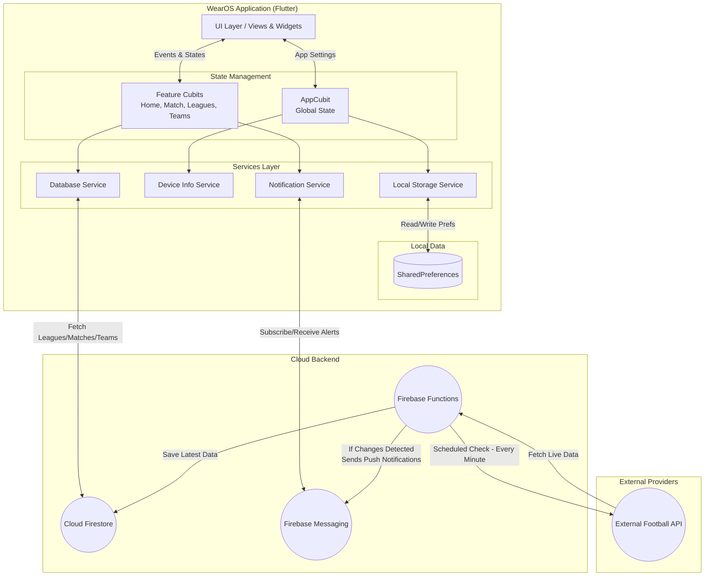

# 📖 Tiki Taka WearOS

Welcome to the comprehensive documentation for the **Tiki Taka WearOS** application. This guide covers all key Dart files, organized by functional modules, explains their responsibilities, and illustrates how they interconnect to manage live football matches, leagues, and teams using Firebase as the backend.

---

## 📑 Table of Contents

1. [Architecture](#%EF%B8%8F-architecture)
2. [App Core](#app-core)
   2.1 [State Management](#state-management)
   2.2 [Global Utilities](#global-utilities)
   2.3 [Routing & Themes](#routing--themes)
   2.4 [Services](#services)
   2.5 [UI Layer (View & Widgets)](#ui-layer-view--widgets)
3. [Feature Modules](#feature-modules)
   3.1 [Ambient Mode](#ambient-mode)
   3.2 [Home](#home)
   3.3 [Leagues](#leagues)
   3.4 [Match](#match)
   3.5 [Notifications](#notifications)
   3.6 [Settings](#settings)
   3.7 [Team & Teams](#team--teams)
4. [Localization (l10n)](#localization-l10n)
5. [Bootstrap & Entrypoint](#bootstrap--entrypoint)
6. [Packages & Data Models](#packages--data-models)
7. [Configuration (`pubspec.yaml`)](#configuration-pubspecyaml)

---

# 🏗️ Architecture

- **UI (Flutter Interface)**: Standardized presentation layer designed for WearOS that sends events to the State and interacts with the Services.
- **State (Bloc/Cubit)**: Manages the application logic, handles read/write operations with the Local DB, and interacts with external services.
- **Store (Local DB - SharedPreferences)**: Handles local data persistence on the smartwatch for quick access and preferences.
- **Services (Firebase & Local)**: Main communication gateway managing device info, notifications via Firebase Messaging, local storage, and real-time database updates from Firestore.
- **Backend**: Firebase provides the core backend infrastructure. A scheduled **Firebase Function** runs every minute to fetch real-time match data from an **External Football API**. If changes are detected compared to the current **Firestore** data, the function updates Firestore and triggers **Firebase Messaging** to deliver notifications directly to the WearOS device.

---

## App Core

### 1. State Management

| File                             | Role                                                                                          |
|----------------------------------|-----------------------------------------------------------------------------------------------|
| **lib/app/cubit/app_cubit.dart** | Manages **global app state**: core configurations and fundamental app states during runtime. |
| **lib/app/cubit/app_state.dart** | Immutable state variables serving core elements. Supports `copyWith`.        |

---

### 2. Global Utilities

| File                             | Role                                                                                          |
|----------------------------------|-----------------------------------------------------------------------------------------------|
| **lib/app/helpers/***            | Collection of UI/data helper functions (`color_helper.dart`) for app-wide UI/logic processing. |
| **lib/app/global/***             | App-wide constants, properties, routes, themes, extensions, and dependencies configuration variables. |

---

### 3. Routing & Themes

| File                                  | Role                                                                                  |
|---------------------------------------|---------------------------------------------------------------------------------------|
| **lib/app/global/routes.dart**        | Defines the navigation graph defining paths to home, matches, teams, settings, etc. |
| **lib/app/global/themes.dart**        | Defines theme mappings to adjust UI colors and typography optimized for WearOS displays. |
| **lib/app/global/dependencies.dart**  | Configuration setup for singletons and dependency injection. |

---

### 4. Services

| File                                            | Role                                                                                |
|-------------------------------------------------|-------------------------------------------------------------------------------------|
| **lib/app/services/database_service.dart**      | Handles data retrieval operations for leagues, matches, and teams via Cloud Firestore. |
| **lib/app/services/device_info_service.dart**   | Acquires specific hardware or OS information from the WearOS smartwatch. |
| **lib/app/services/local_storage_service.dart** | Singleton managing local database persistence using `SharedPreferences`. |
| **lib/app/services/notification_service.dart**  | Manages push notifications and real-time alerts. |

---

### 5. UI Layer (View & Widgets)

#### View

| File                               | Role                                                                                          |
|------------------------------------|-----------------------------------------------------------------------------------------------|
| **lib/app/view/app.dart**          | Consumes `AppCubit` and configures application components including themes, routing, and l10n. |

#### Widgets

| File                          | Role                                                                                                             |
|-------------------------------|------------------------------------------------------------------------------------------------------------------|
| **lib/app/widgets/***         | Global shared UI custom components designed specifically for the limited screen real estate of a smartwatch.     |
| **lib/themes/***              | Reusable components related to app styling and visual presentation.                      |

---

## Feature Modules

Each feature follows a standard architecture pattern structure suited for WearOS:
1. **barrel** file exporting components.
2. **Cubit**: Specific logic management (`cubit` folder).
3. **View**: UI implementation relying on the emitted states (`view` folder).

---

### Ambient Mode

- **lib/ambient_mode/***  

**Features:**  
Handles the smartwatch's always-on display mode, providing an optimized, low-power interface while the app is inactive but visible.

---

### Home

- **lib/home/***  

**Highlights:**  
- Acts as the main application dashboard exposing recent matches, leagues, and entry points.

---

### Leagues

- **lib/leagues/***  

**Capabilities:**  
- Lists the available monitored football leagues and provides navigation to their specific matches and tables.

---

### Match

- **lib/match/***  

**Features:**  
- Displays real-time details of an ongoing or finished football match, including scores, incidents, and timing.

---

### Notifications

- **lib/notifications/***  

**Controls:**  
- Manages user-facing alerts and updates for match events sent via Firebase Cloud Messaging.

---

### Settings

- **lib/settings/***  

**Controls:**  
- Unified hub altering universal parameters. Passes preferences backward to be maintained securely inside `LocalStorageService`.

---

### Team & Teams

- **lib/team/***  
- **lib/teams/***  

**Highlights:**  
- **Team**: Shows deep details, line-ups, and statistics for a specific football club.
- **Teams**: Provides an overview or list of teams within a competition or league.

---

## Localization (l10n)

| File                               | Role                                                  |
|------------------------------------|-------------------------------------------------------|
| **lib/l10n/***                     | Dictionary values and ARB files for different locales.|
| **lib/languages/***                | Additional language configuration logic and structures.|

**Mechanism:** Utilizing standard multi-language structures to support global football fans.

---

## Bootstrap & Entrypoint

| File                          | Role                                                                                   |
|-------------------------------|----------------------------------------------------------------------------------------|
| **lib/bootstrap.dart**        | Intercepts application initialization, configuring error logging and calling `runApp()`. |
| **lib/main.dart**             |    1. Triggers initial execution context.   2. Sets up dependencies and Firebase.   3. Dispatches execution flow over to `bootstrap`. |

---

## Packages & Data Models

Tiki Taka Scoreboard WearOS uses remote synchronization through Firestore while maintaining a clean entity structure locally.

### Data Models

- **lib/app/models/match.dart**: Contains the parameters of an individual football match.
- **lib/app/models/team.dart**: Represents a football team's details.
- **lib/app/models/league.dart**: Represents user-selectable leagues and competitions.
- **Further Models**: Encompasses `area.dart`, `competition.dart`, `score.dart`, `season.dart`, `standing.dart`, `staff.dart`, `referee.dart`, `odds.dart`, and `table.dart`.

These classes interact seamlessly as the main underlying format populating the application views for match tracking.

---

## Configuration (`pubspec.yaml`)

- Core dependencies defining internal toolings including standard Flutter state management methodologies.
- Adapted specifically for the WearOS environment constraints and form factor.
- Includes code quality lint rules via `very_good_analysis` and incorporates solid architectural practices for testing and mocking.

---

> **Enjoy exploring football matches straight from your wrist with Tiki Taka WearOS!**
